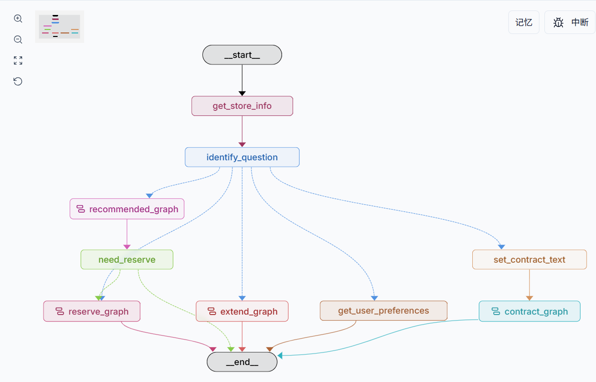

# RentAgent — 智能租房助手

[](https://github.com/langchain-ai/new-langgraph-project/actions/workflows/unit-tests.yml)
[](https://github.com/langchain-ai/new-langgraph-project/actions/workflows/integration-tests.yml)

基于 [LangGraph](https://github.com/langchain-ai/langgraph) 构建的智能租房助手，支持**房源推荐**、**预约预定**、**偏好管理**和**合同审核**四大功能。

<div align="center">
  
</div>

## 功能模块

| 模块 | 说明 |
|------|------|
| **房源推荐** | 基于用户偏好（城市、预算、户型等），通过 Text-to-SQL 对话式查询房源数据库，智能推荐匹配房源 |
| **预约预定** | 人机协作收集预定信息（房源、联系方式、证件），自动生成订单并持久化 |
| **偏好管理** | 记忆用户租房偏好（预算范围、意向区域等），跨会话复用，减少重复询问 |
| **合同审核** | 上传租房合同 → 智能提取关键条款 → 检索相关法律条文 → 逐条风险分析 → 生成专业审核报告 |

## 合同审核 — 技术架构

```
用户上传合同文本
       │
       ▼
  ┌──────────────┐
  │ 条款提取节点  │  LLM 结构化提取（租金/押金/租期/违约等 9 类条款）
  └──────┬───────┘
         │
         ▼
  ┌──────────────┐
  │ 法律检索节点  │  查询改写 + 混合检索(BM25+FAISS) + CrossEncoder 重排序
  └──────┬───────┘
         │
         ▼
  ┌──────────────┐
  │ 风险分析节点  │  LLM 逐条对照法律法规评估风险（高/中/低）
  └──────┬───────┘
         │
         ▼
  ┌──────────────┐
  │ 报告生成节点  │  输出结构化审核报告（概览 + 条款 + 风险 + 建议）
  └──────────────┘
```

**检索策略**：口语化查询 → LLM 改写为法律术语 → EnsembleRetriever（BM25 权重 0.4 + FAISS 向量 权重 0.6）→ CrossEncoder Reranker 精排 → Top-K 结果

**索引持久化**：首次启动构建 FAISS Flat 索引 + BM25 索引，存储到 `storage/` 目录；后续启动检测文件哈希，无变更则直接加载，避免重复构建。法律 PDF 放入 `docs/` 目录即可。

## 项目结构

```
src/agent/
├── graph.py            # 主图：意图识别 → 路由分发
├── recommend.py        # 子图：房源推荐（Text-to-SQL）
├── reserve.py          # 子图：预约预定（人机协作）
├── extend.py           # 子图：通用对话扩展
├── contract.py         # 子图：合同审核（条款提取 + 法律检索 + 风险分析）
├── common/
│   ├── llm.py          # LLM 配置（DeepSeek）
│   ├── content.py      # 运行时上下文 Schema
│   ├── store.py        # 持久化数据模型
│   └── retriever.py    # 法律检索器（BM25 + FAISS + Reranker）
├── node/
│   ├── main.py         # 主图节点
│   ├── recommend.py    # 推荐图节点
│   ├── reserve.py      # 预定图节点
│   ├── contract.py     # 合同审核图节点
│   └── mysql_connect.py
└── state/
    ├── main.py
    ├── recommend.py
    ├── reserve.py
    └── contract.py     # 合同审核状态定义
```

## 快速开始

### 1. 安装依赖

```bash
cd path/to/rent-agent
pip install -e . "langgraph-cli[inmem]"
```

### 2. 配置环境变量

```bash
cp .env.example .env
```

在 `.env` 中配置 DeepSeek API Key 等信息。

### 3. 准备法律文档（合同审核功能）

将法律条文 PDF（如《中华人民共和国民法典》租赁合同相关章节）放入 `docs/` 目录。首次启动时会自动构建检索索引并缓存到 `storage/`。

### 4. 启动服务

```bash
langgraph dev
```

服务启动后在 [LangGraph Studio](https://langchain-ai.github.io/langgraph/concepts/langgraph_studio/) 中可视化调试和运行。

## 技术栈

- **框架**: LangGraph + LangChain
- **模型**: DeepSeek (Chat + Reasoner)
- **向量存储**: FAISS Flat
- **稀疏检索**: BM25
- **重排序**: CrossEncoder (bge-reranker-v2-m3)
- **Embedding**: bge-small-zh-v1.5
- **持久化**: LangGraph Store + MySQL (检查点)
- **PDF 解析**: PyMuPDF
